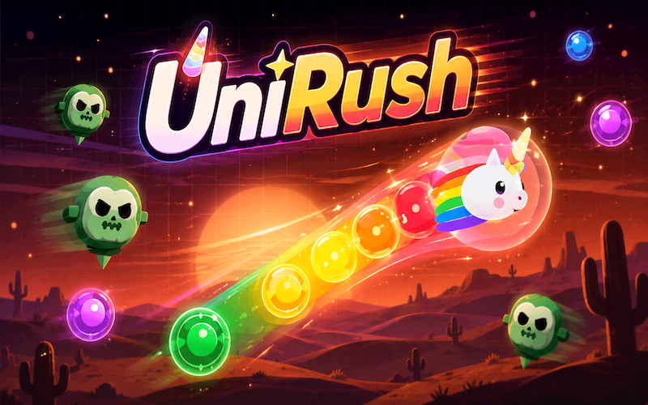
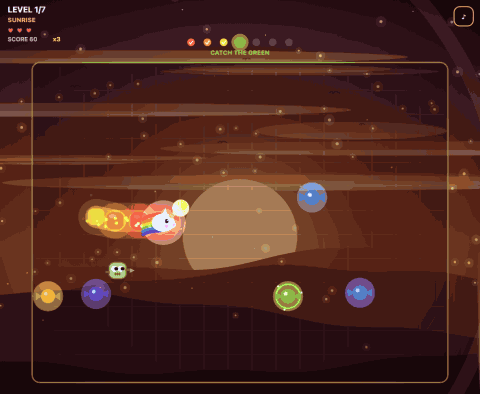

# Unirush

**js13kGames 2026 entry. Theme: Unicorns and Rainbows.**
A snake game where the order of what you eat is the whole puzzle.




*Ten seconds of real play, recorded by an autopilot: `node scripts/record-gif.mjs`.*

Everything fits in a single HTML file under 13 kB, zipped. No images, no audio
files, no libraries. Every sprite is drawn with canvas paths, every sound is
generated with the Web Audio API, and all seven worlds are painted by code at
runtime.

---

## How to play

You are a unicorn. The zombies drained the colours out of the world, and you
put them back by catching them **in rainbow order**.



| Rule | What happens |
|---|---|
| Catch red, then orange, then yellow... | Each colour adds one segment to your tail |
| Catch the wrong colour | You lose the last colour you had, and its tail segment |
| Touch a zombie | You lose a life (you have three) |
| A zombie touches your trail | It explodes and comes back 10 s later, far away |
| Complete all 7 colours | You ride a rainbow bridge into the next world |

Seven worlds, seven colours, and a final boss that chases you.
Arrow keys, WASD/ZQSD, or swipe on mobile.

### Things worth noticing

- **Zombies telegraph their next move.** Their pupils and a small arrow point
  at the cell they are about to enter, and they will *never* go anywhere else.
  If that cell gets blocked, they wait instead. Every death is avoidable.
- **Your trail is a weapon.** Tron-style: lure a zombie into your own rainbow
  and it is gone for ten seconds. Even the boss, if you box it in completely.
- **The world is grey until you fix it.** A bubble of colour follows you and
  grows with every colour you catch. By violet, the whole screen is restored.
- **The music builds with the rainbow.** One theme, seven arrangements. It
  starts as a bare drone and a bass, then the pulse, the chords, the melody and
  the sparkles come in as you progress. Complete a rainbow and you hear the
  whole Rainbow Fanfare.
- There is a real ending. Beat world 7 and find out what the zombies were.

### Trophies

Ten of them, and they work everywhere the game does. The banner that announces
them is drawn on the canvas, so it shows up on js13kgames.com, on Wavedash and
on a file you opened from your disk alike. When the Wavedash SDK is around the
trophy is also stored on your account; when it is not, nothing happens and the
banner shows anyway.

| Trophy | How you get it |
|---|---|
| First Blood | Crash your first zombie into your rainbow trail |
| Perfect Rainbow | Complete a whole rainbow without eating a single wrong candy |
| Halfway There | Reach world 4 |
| Boss Down | Take down the boss that guards the seventh world |
| Zombie Hunter | Crash 10 zombies in a single run |
| Rainbow Freed | Finish the game |
| Flawless | Finish the game without losing a single life |
| Speed of Light | Finish the game in under 100 seconds |
| Pacifist | Finish the game without crashing a single zombie |
| Last Hope | Finish the game on your very last life |

Pacifist and Zombie Hunter pull in opposite directions on purpose: one rewards
never touching a zombie, the other rewards hunting ten of them.

The label on the banner is derived from the trophy id, so `FIRST_BLOOD` prints
as FIRST BLOOD. Carrying a second table of display names would have cost more
than the budget had left. That is also why two ids read oddly for an identifier
and perfectly for a banner: `SPEED_OF_LIGHT` and `HALFWAY_THERE`.

Unlocks are remembered in memory, not on disk, so a trophy congratulates you
again after a page reload. On Wavedash the account keeps the real record; the
banner is a celebration, not a save file.

About the 100 second threshold: an autopilot with near-optimal pathfinding
finishes in 83 to 97 s across eight seeds when it does not die, and the
theoretical floor of the game, the distance to cover multiplied by the snake's
speed with a clear path throughout, averages 80 s over six seeds. The autopilot
is therefore already within 11 % of the floor: the time is set by how far you
have to travel and how fast the snake moves, not by how well you play. A death
restarts the level and costs about 11 s. At 120 s the trophy would have come
free with any finish; 100 s asks for a clean run.

---

## Running it

```bash
npm install     # terser + roadroller
npm run serve   # http://localhost:8013
npm run build   # produces dist/index.html and unirush.zip
```

`src/index.html` is the readable, commented source. That is the file to edit.
`dist/` and the zip are generated, never edited by hand.

Extra build options:

```bash
npm run build -- --no-rr    # skip roadroller (fast, for quick size checks)
npm run build -- --best=6   # run roadroller 6 times, keep the smallest zip
npm run watch               # rebuild on every save
```

---

## How the 13 kB budget is spent

The build chain is in `scripts/build.js`:

1. The `<style>` and `<script>` are pulled out of `src/index.html`.
2. **terser** minifies the JavaScript (3 passes, top-level mangling).
   Note what is *not* enabled: `booleans_as_integers`. It rewrites `true` as
   `1`, which is free everywhere except at an API boundary that type-checks its
   arguments. The Wavedash SDK does exactly that, so `setAchievement(id, !0)`
   became `setAchievement(id, 1)`, the SDK threw, our guard swallowed it, and
   no trophy or score was ever sent. Only from the build, never from
   `src/index.html`, which is the nastiest shape a bug can take here. It costs
   17 B of terser output to leave the flag off, and about 1 B once roadroller
   and advzip have had their turn.
3. **roadroller** re-encodes the minified JS into a self-extracting bundle.
   It is run with `-O2`, which searches for the best parameters. This is the
   single biggest win in the chain: it roughly cuts the terser output by two
   thirds. The `-O2` search is also what makes a full build take about 30 s.
4. A minimal HTML shell is rebuilt around it: no `<html>`, no `<head>`,
   no `<body>`, since browsers insert those anyway.
5. `zip -9`.
6. **advzip** recompresses the zip's deflate stream with zopfli. Same bytes
   inside, about 390 fewer outside. It is optional: without
   `brew install advancecomp` the build just keeps the zip from step 5.

The dev panel at the bottom of `src/index.html` is stripped before terser even
sees it, so none of its 5 402 B can reach the zip.

Measured on the current build:

| Stage | Size |
|---|---|
| Readable source (JS only, dev panel already stripped) | 72 458 B |
| After terser | 47 792 B |
| After roadroller | 17 168 B |
| Final HTML | 17 581 B |
| After `zip -9` | 13 646 B |
| After advzip | **13 251 to 13 263 B** of 13 312 max |

The same source does not produce the same zip twice. `roadroller -O2` runs a
randomised parameter search, so two plain builds of an identical
`src/index.html` came out at 13 249 and 13 267 B. That 18 B swing is a real
risk when under 60 B are left, so `--best=N` runs roadroller N times and keeps
the smallest draw. Over six draws the roadroller output spanned 33 B.

`--best=6` does not remove the lottery, it only improves the odds: three runs
of it landed on 13 251, 13 254 and 13 263 B. Plan on the worst of those, not
the best. Raising N buys a little more, with diminishing returns.

Build the zip you submit with `--best`. Never trust a margin written down
here; read the number the build prints.

If the build ever goes over budget it exits with a non-zero status, so it can
be wired into CI.

---

## Project layout

```
unirush/
├─ src/index.html        the game, readable and commented (edit this)
├─ scripts/build.js      terser -> roadroller -> zip, with a size report
├─ scripts/serve.js      local dev server on :8013
├─ scripts/record-gif.mjs replays a seeded game on autopilot -> media/gameplay.gif
├─ package.json          build scripts and the two dev dependencies
├─ package-lock.json     pins terser and roadroller versions
├─ wavedash.toml         which game to upload to, and from which folder
├─ wavedash-achievements.json  the ten trophies, in the portal's import format
├─ .nvmrc                Node 18
├─ .gitignore
├─ media/                the GIF shown at the top of this README
├─ LICENSE               MIT
├─ dist/                 generated build output (gitignored)
└─ unirush.zip           the file to submit (gitignored, rebuilt by npm run build)
```

---

## Submitting to js13kGames 2026

The competition rules are at <https://js13kgames.com/rules>. What they require,
and where this project stands:

| Rule | Status |
|---|---|
| Zip must be 13 312 bytes or less | 13 251 to 13 263 B with `--best=6`, so 49 B to spare in the worst run seen |
| `index.html` at the top level of the zip | one entry, no subfolder |
| No external resources at all, everything inside the zip | no URL, no `fetch`, no external font; the Wavedash block only reads a global the host injects, and loads nothing |
| A GitHub repository with readable, unmangled source | `src/index.html` is the readable source |
| The repo must contain what is needed to *build* the game, not just an unzipped copy | `scripts/build.js` + `package.json` + lockfile |
| Works in latest Chrome and Firefox, with no console errors | measured: 0 errors, 0 warnings in both |
| `localStorage` keys namespaced per game, never `localStorage.clear()` | key is `unirushBest` |

Dates for the 2026 edition, taken from the official rules page:

- Submissions: **13 August 13:00 CEST to 13 September 2026, 13:00 CEST**
- Unfinished entries and bugfix PRs: 14 September 2026
- Voting: 14 September to 4 October 2026

Categories open in 2026: Desktop, Mobile, Online, WebXR, plus Unfinished and
the new Wavedash challenge. What the rules actually forbid is narrower than it
first sounds: "sending the same game as independent submissions targeting
different platforms (e.g. separate desktop and mobile builds)". One entry that
plays on both is fine, and this game has swipe controls, so do not rule out
Mobile.

### The 2026 upload test, and why it matters here

New in 2026: every zip you upload is run through an automatic in-browser test in
Chromium, and it blocks you from continuing if the console has errors. The
announcement warns that the test machine has constrained resources, and it names
our exact situation:

> heavily compressed games (e.g. Roadroller) can take a few good seconds to
> actually process

Measured on this game, page load to `domInteractive`:

| CPU throttling | With roadroller | Terser only |
|---|---|---|
| none | 672 ms | 34 ms |
| 4x slower | 2 886 ms | 138 ms |
| 8x slower | 6 024 ms | 283 ms |

So roadroller decoding is 95 % of the startup cost, and the game's own setup
(seven procedurally painted worlds) is only 34 ms.

Roadroller's context count is the dial that trades size against decode speed.
Measured across variants, all built from the same terser output:

| Roadroller contexts | Zip | Decode at 8x throttling |
|---|---|---|
| 12, `-O2` tuned (current) | 13 073 B | 5 970 ms |
| 12, defaults | 13 074 B | 5 658 ms |
| **9** | **13 144 B** | **4 252 ms** |
| 6 | 13 598 B | over the limit |
| 4 | 14 941 B | over the limit |

Those decode timings still hold, but the zip column was measured before advzip
and before the Wavedash block, so read it for the shape of the curve, not for
the absolute numbers.

The shape is what matters, and it has turned against us. Re-measured on the
current source with roadroller settings held equal, dropping from 12 contexts
to 9 costs 66 B, and the worst `--best=6` run leaves 49.
**The decode-speed lever no longer fits.**
Pulling it now means finding bytes elsewhere first; the cheapest is swapping
`getOrCreateLeaderboard` for `getLeaderboard`, worth 15 to 20 B, and only safe
once all four leaderboards exist, since the shorter call cannot create a
missing one and scores would vanish in silence.

If the upload test ever rejects the build for taking too long, the
announcement says to get in touch with the organisers.

The submission asks for two things: the **playable** zip, and the **readable**
repository. Organisers clone the repo under the
[js13kGames GitHub organisation](https://github.com/js13kGames) so other people
can learn from it, which is why `src/index.html` is kept commented and
unminified.

### The Wavedash challenge

Wavedash is a browser-game platform, and the 2026 competition adds it as a
*challenge*: a checkbox on the same js13k entry, not a second submission. The
rules give an extra week, to 20 September 2026, to deploy there and nothing
else. No new features, no bugfixes in that week.

One line of code is mandatory. The platform injects a `Wavedash` global before
the game runs, and until `Wavedash.init()` is called the game stays hidden
behind the platform's loading screen and never appears. Everything the SDK
touches sits in one block at the bottom of `src/index.html`, guarded so that a
missing global, a signed-out player or a dead network changes nothing and
prints nothing. On js13kgames.com the whole block is inert.

Leaderboards only exist there. They need a server, so unlike the trophies they
have no meaning on js13kgames.com.

| Leaderboard | Score | Sent when |
|---|---|---|
| `fastest-run` | run time, ascending | you finish the game |
| `fastest-flawless-run` | run time, ascending | you finish without losing a life |
| `zombies-before-first-hit` | zombies, descending | your first life is lost, or you finish untouched |
| `zombies-flawless-run` | zombies, descending | you finish without losing a life |

A leaderboard is created the first time a player meets its condition, so three
of the four stay invisible on the game page until somebody actually finishes
the game. Creating them up front in the Developer Portal, or through the dev
panel's "create the 4" button, avoids a lone leaderboard on an otherwise empty
page.

The best score also rides on Wavedash's remote storage, synced across a
player's devices, with `localStorage` as the fallback everywhere else.

Two things the SDK's own docs do not say, found by reading its source:
`setAchievement()` silently does nothing until `requestStats()` has answered,
and nothing at all for an id that is absent from the Developer Portal. It
returns `false` either way. `wavedash-achievements.json` holds the ten trophies
in the portal's bulk-import format so the ids cannot drift apart.

The dev panel at the bottom of `src/index.html` exists for all of this: it
fires any trophy, forces a win with arbitrary lives, kills and run time, and
reads the SDK state back. It is stripped from the build, so open the source
file directly to use it.

### Before submitting

```bash
npm run build -- --best=6   # must print DANS LE BUDGET
unzip -l unirush.zip        # must show exactly one index.html, no __MACOSX
```

Then open `dist/index.html` in Chrome *and* Firefox, play a full world, and
check the console is clean.

Never submit the zip produced by `npm run build -- --no-rr`. That flag skips
roadroller but still overwrites `unirush.zip`, and the result is around
16 kB, well over the limit.

---

## Who made this

I am **Ruben**, I am 9 years old, and this is my game.

I am learning to make games with my dad, who does this for a living, and with
Claude. My dad explains how things work and checks what goes in, Claude helps me
turn my ideas into code, and I decide what the game is.

The design is mine: the snake-unicorn with a rainbow tail, eating in colour
order, wandering zombies that spawn per world, the Tron trail crash, three
lives, the telegraphed zombie eyes, and the rule that finishing a rainbow must
freeze the game instantly so you can never die after winning.

## Credits

Game design by **Ruben, age 9**.

Code and art direction pair-programmed with my dad and with Claude (Anthropic).

Music: *Rainbow Fanfare*, an original 4-bar theme, arranged seven ways.

MIT licensed. Do whatever you like with it.
